# GYMMY - Dokumentasi Teknis dan Diagram Source of Truth

Dokumen ini dibuat dari inspeksi kode aktual project Flutter GYMMY. Tujuannya menjadi sumber utama untuk membuat ERD, use case diagram, activity diagram, flowchart, sequence diagram, DFD, architecture diagram, navigation map, state transition diagram, database mapping, feature mapping, dan role permission matrix.

Status dokumentasi: berdasarkan implementasi saat ini di folder `lib/`, `pubspec.yaml`, konfigurasi Firebase, Android manifest, route, provider, repository, model/entity, screen, dan akses Firestore yang ditemukan di kode.

## 1. Project Identity

| Item | Detail |
| --- | --- |
| Project name | GYMMY |
| App type | Aplikasi mobile manajemen gym dan membership |
| Platform | Flutter multi-platform, fokus Android; konfigurasi iOS, Web, Windows tersedia dari FlutterFire |
| Main purpose | Membantu owner mengelola gym, member, kelas, peralatan, harga, dan QR check-in; membantu member menemukan gym, aktivasi membership, check-in, melihat aktivitas, dan mengelola profil |
| Development method | Feature-first dengan pola Clean Architecture parsial |
| Backend | Firebase |
| Database | Cloud Firestore |
| Authentication | Firebase Authentication |
| Asset storage | Firebase Storage package tersedia; implementasi utama gambar masih banyak memakai URL langsung |
| Architecture | `core/` untuk shared infrastructure dan `features/` untuk modul |
| State management | Riverpod 3 |
| Routing | GoRouter dengan `StatefulShellRoute.indexedStack` untuk bottom navigation owner dan member |
| Dependency injection | GetIt |
| Main user roles | Member dan Owner |

## 2. Executive Summary

GYMMY adalah aplikasi Flutter untuk menghubungkan owner gym dan member. Owner dapat mendaftarkan akun, membuat profil gym, melihat dashboard, mengelola harga, peralatan, kelas, benefit rank, daftar membership, riwayat, profil gym, serta QR membership. Member dapat mendaftar, login, melengkapi biodata, mencari gym, melihat detail gym, aktivasi membership melalui QR owner, melihat dashboard member aktif, melihat peralatan dan kelas gym, berlangganan kelas, melihat aktivitas, menampilkan QR harian, dan mengubah profil/biodata.

Firebase mendukung autentikasi dan penyimpanan data. Firebase Auth dipakai untuk login/register/logout, sedangkan Cloud Firestore dipakai untuk user profile, biodata, gym tenant, membership, QR session, log check-in, visit harian, kelas, subscription kelas, peralatan, dan rank. QR dipakai untuk dua alur utama yang aktif: member men-scan QR membership milik owner untuk aktivasi membership, dan owner men-scan QR harian milik member untuk mencatat check-in.

## 3. Problem Statement

Masalah nyata yang ditangani oleh implementasi saat ini:

1. Owner membutuhkan tempat terpusat untuk mengelola data gym, harga, peralatan, kelas, benefit rank, dan daftar member.
2. Member membutuhkan cara menemukan gym aktif dan melihat detail harga/fasilitas.
3. Aktivasi membership dibuat lebih cepat melalui QR membership dari owner.
4. Check-in harian dibuat lebih aman dengan QR session yang memiliki masa berlaku dan status sekali pakai.
5. Riwayat check-in perlu dapat dilihat oleh member dan owner.
6. Dashboard owner membutuhkan ringkasan member, check-in, kelas, peralatan, aktivitas terbaru, dan statistik bulanan.
7. Member aktif membutuhkan dashboard membership, sisa periode, progress, check-in terakhir, kelas aktif, dan aktivitas terbaru.
8. Benefit rank tersedia sebagai data master berbasis poin, walau integrasi otomatis poin/rank belum lengkap.

## 4. Scope

### In Scope

- Splash screen dan onboarding 3 halaman.
- Login, register member, register owner, logout.
- Persistensi onboarding dan tema menggunakan SharedPreferences.
- Reset tema ke light mode saat logout.
- Biodata onboarding dan biodata detail.
- Routing berdasarkan role, biodata, owner gym setup, dan active membership.
- Gym discovery dan detail gym.
- Owner gym setup wizard.
- Owner dashboard dengan ringkasan, quick action, aktivitas terbaru, dan statistik bulanan check-in/membership.
- Owner Kelola Data berisi Harga Paket, Peralatan Gym, Kelas Gym, dan Data Benefit Rank.
- CRUD peralatan gym.
- CRUD kelas gym.
- CRUD benefit rank.
- Update harga harian dan membership gym.
- Update profil gym owner.
- Daftar membership owner dengan filter dan pencarian nama/email.
- Member dashboard untuk active membership.
- Member Gym Saya tab Peralatan dan Kelas.
- Subscription kelas oleh member.
- Member activity dan owner history.
- QR harian member dengan expiry 5 menit.
- QR membership owner.
- QR scanner owner untuk daily check-in.
- QR scanner member untuk membership activation.
- Light mode dan dark mode.

### Partial or Not Fully Implemented

| Fitur | Status |
| --- | --- |
| QR kelas (`class_subscription`, `class_attendance`) | Partial implementation. Type dikenali di `OwnerScanQrScreen`, tetapi handler lengkap tidak ditemukan. |
| Payment gateway | Not found in current implementation. Harga disimpan, tetapi tidak ada paket payment gateway. |
| Daily access payment | Partial implementation. Field `daily_visit_payment_status` diisi `paid`, tetapi pembayaran nyata tidak ditemukan. |
| Firebase Storage untuk upload gambar | Partial implementation. Package ada, tetapi alur UI utama peralatan memakai URL gambar langsung. |
| Poin otomatis | Partial implementation. Field poin ada, aktivitas dapat menampilkan poin, tetapi increment poin saat check-in tidak ditemukan sebagai flow lengkap. |
| Rank otomatis | Partial implementation. Rank dihitung untuk display owner membership berdasarkan poin/min threshold, tetapi update `mem_current_rank_id` otomatis tidak ditemukan. |
| Review gym | Not found in current implementation. |
| Offline mode | Not found in current implementation. |
| Notifikasi push | Not found in current implementation. |
| Checkout keluar gym | Partial implementation. Field `daily_visit_checkout_at` ada, tetapi flow checkout tidak ditemukan. |

### Out of Scope

- Payment gateway produksi.
- Sistem subscription berbayar otomatis.
- Push notification.
- Admin superuser.
- Laporan keuangan lengkap.
- Integrasi maps.
- Kalender kelas interaktif.
- Backend custom selain Firebase.
- Mode offline-first.

## 5. Technology Stack

| Layer | Technology / Package | Version | Real Purpose | Used In File |
| --- | --- | --- | --- | --- |
| Framework | Flutter SDK | SDK | UI mobile multi-platform | `lib/main.dart` |
| Language | Dart | `^3.11.0` | Bahasa utama aplikasi | `pubspec.yaml` |
| Firebase init | `firebase_core` | `^4.0.0` | Inisialisasi Firebase app | `lib/main.dart`, `lib/firebase_options.dart` |
| Auth | `firebase_auth` | `^6.0.1` | Login/register/logout | `lib/features/auth/data/datasources/auth_remote_datasource.dart` |
| Database | `cloud_firestore` | `^6.0.0` | Read/write Firestore | Banyak repository dan screen |
| Storage | `firebase_storage` | `^13.4.0` | Potensi penyimpanan gambar | Package tersedia, implementasi utama masih URL |
| State management | `flutter_riverpod` | `^3.3.1` | Provider, Notifier, FutureProvider, StreamProvider | `lib/core/providers/`, `lib/features/**/providers/` |
| Routing | `go_router` | `^17.2.3` | Route guard dan shell navigation | `lib/core/routing/app_router.dart` |
| Dependency injection | `get_it` | `^9.2.1` | Registrasi datasource, repository, usecase | `lib/core/di/injection.dart` |
| Typography | `google_fonts` | `^8.1.0` | Montserrat dan Inter | `lib/core/theme/app_typography.dart` |
| Icons | `lucide_icons` | `^0.257.0` | Icon UI tertentu | `pubspec.yaml`, UI app |
| Local persistence | `shared_preferences` | `^2.5.5` | Onboarding dan theme mode | `lib/core/providers/onboarding_provider.dart`, `theme_provider.dart` |
| Date/format | `intl` | `^0.20.2` | Format tanggal dan Rupiah Indonesia | Dashboard, membership, class, price |
| QR generator | `qr_flutter` | `^4.1.0` | Render QR | `daily_qr_screen.dart`, `membership_qr_display_screen.dart` |
| QR scanner | `mobile_scanner` | `^7.2.0` | Scan QR dengan kamera | `owner_scan_qr_screen.dart`, `member_scan_membership_screen.dart` |
| Image picker | `image_picker` | `^1.2.0` | Potensi memilih gambar | Package tersedia |
| iOS icons | `cupertino_icons` | `^1.0.8` | Icon Cupertino default | `pubspec.yaml` |
| Lint | `flutter_lints` | `^6.0.0` | Lint Flutter | `analysis_options.yaml` |
| Build tooling | `build_runner` | `^2.15.0` | Build generator bila dibutuhkan | `pubspec.yaml` |
| Chart library | Not found in current implementation | - | Statistik bulanan memakai widget custom bar, bukan package chart | `owner_dashboard_screen.dart` |

## 6. Architecture Overview

Project memakai struktur feature-first. Modul yang lebih matang mengikuti pola data-domain-presentation:

- Data layer: datasource Firebase, model, repository implementation.
- Domain layer: entity, repository contract, usecase.
- Presentation layer: screen, widget, provider.
- Core layer: dependency injection, routing, theme, reusable widgets, shared providers.

Tidak semua fitur memakai repository/usecase penuh. Beberapa screen owner/member langsung mengakses `FirebaseFirestore.instance`, terutama CRUD dashboard owner, history, membership list, dan QR screens. Karena itu arsitektur saat ini adalah Clean Architecture parsial, bukan Clean Architecture murni.

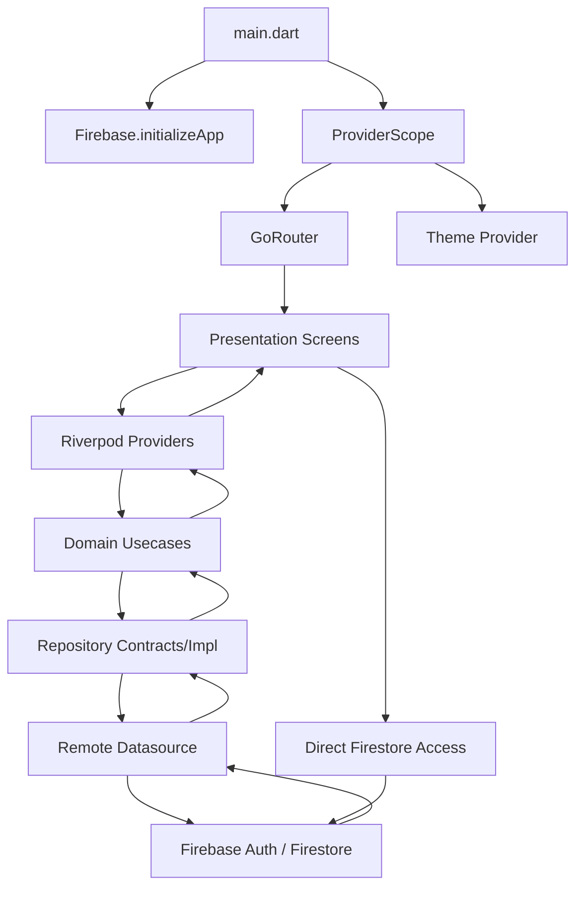

## 7. Folder Structure

Ringkasan struktur aktual:

```text
lib/
  core/
    di/
    providers/
    routing/
    theme/
    widgets/
  features/
    auth/
    biodata/
    gym_tenant/
    member_dashboard/
    membership/
    onboarding/
    owner_dashboard/
    qr_system/
    settings/
    splash/
  firebase_options.dart
  main.dart
assets/
  logos/
android/
  app/
ios/
web/
test/
```

| Folder | Purpose | Important Files | Related Features |
| --- | --- | --- | --- |
| `lib/core/di` | Dependency injection | `injection.dart` | Auth, biodata, gym tenant, membership |
| `lib/core/providers` | Provider global | `onboarding_provider.dart`, `theme_provider.dart`, `user_flow_provider.dart` | Onboarding, dark mode, role flow |
| `lib/core/routing` | App router | `app_router.dart`, `route_names.dart` | Auth guard, owner/member shell |
| `lib/core/theme` | Theme dan token | `app_colors.dart`, `app_theme.dart`, `app_typography.dart` | Light/dark UI |
| `lib/core/widgets` | Widget reusable | `gymmy_button.dart`, `gymmy_input.dart`, `gymmy_card.dart`, `gymmy_app_bar_logo.dart` | Shared UI |
| `lib/features/auth` | Login/register/session | datasource, model, provider, screen, usecase | Firebase Auth |
| `lib/features/biodata` | Biodata user | biodata model/provider/screen | Biodata onboarding/detail |
| `lib/features/gym_tenant` | Data gym | discovery/detail/setup | Owner setup, gym discovery |
| `lib/features/member_dashboard` | Area member | shell, dashboard, my gym, activity, profile | Member role |
| `lib/features/membership` | Active membership | datasource/model/provider | Member routing/dashboard |
| `lib/features/onboarding` | Onboarding 3 halaman | `onboarding_screen.dart` | First-run flow |
| `lib/features/owner_dashboard` | Area owner | owner dashboard, CRUD, membership, profile, history | Owner role |
| `lib/features/qr_system` | QR generator/scanner | daily QR, membership QR, owner/member scanner | QR check-in |
| `lib/features/settings` | Pengaturan tema | `theme_settings_screen.dart` | Light/dark/system |
| `assets/logos` | Logo dan onboarding assets | `gymmy_font.png`, `gymmy_logo.png`, onboarding images | Branding |

## 8. Roles and Access Rights

| Feature | Member Without Membership | Active Member | Daily Visitor | Owner |
| --- | --- | --- | --- | --- |
| Login/register | Ya | Ya | Ya | Ya |
| Biodata | Wajib sebelum discovery | Ya | Ya | Tidak wajib untuk owner flow |
| Gym discovery | Ya | Dialihkan ke dashboard aktif | Ya | Tidak |
| Gym detail | Ya | Ya dari discovery bila route tersedia | Ya | Tidak |
| Daily access | Partial implementation | QR harian tersedia untuk active membership | Partial implementation | Validasi daily QR |
| Membership activation | Scan QR membership owner | Sudah aktif, dicegah duplikasi | Bisa aktivasi | Menampilkan QR membership |
| QR scanner | Scan membership QR | Scan membership QR dan tampilkan QR harian | Partial | Scan QR harian member |
| Gym equipment | Terkunci tanpa membership | Lihat daftar/detail | Terkunci tanpa membership | CRUD |
| Classes | Terkunci tanpa membership | Lihat dan langganan kelas | Terkunci tanpa membership | CRUD |
| History/activity | Terbatas | Riwayat aktivitas | Terbatas | Riwayat gym |
| CRUD gym data | Tidak | Tidak | Tidak | Ya |
| Rank benefits | Tidak | Ditampilkan melalui membership/rank data | Tidak | CRUD |
| Profile | Biodata/profil member | Biodata/profil member | Biodata/profil member | Profil owner/gym |
| Dark mode | Ya | Ya | Ya | Ya |

## 9. Complete Feature Map

| Module | Feature | Role | Screen | File Path | Route | Firestore Collection | Status |
| --- | --- | --- | --- | --- | --- | --- | --- |
| Splash | Splash/loading awal | Semua | `SplashScreen` | `lib/features/splash/presentation/screens/splash_screen.dart` | `/` | - | Active |
| Onboarding | 3 page onboarding | Semua belum onboarding | `OnboardingScreen` | `lib/features/onboarding/presentation/screens/onboarding_screen.dart` | `/onboarding` | SharedPreferences | Active |
| Auth | Login | Semua | `LoginScreen` | `lib/features/auth/presentation/screens/login_screen.dart` | `/login` | `user_accounts_global` | Active |
| Auth | Register member/owner | Semua | `RegisterScreen` | `lib/features/auth/presentation/screens/register_screen.dart` | `/register` | `user_accounts_global` | Active |
| Biodata | Biodata onboarding | Member | `BiodataOnboardingScreen` | `lib/features/biodata/presentation/screens/biodata_onboarding_screen.dart` | `/biodata-onboarding` | `user_biodata_profiles`, `user_accounts_global` | Active |
| Biodata | Edit biodata | Member | `BiodataDetailScreen` | `lib/features/biodata/presentation/screens/biodata_detail_screen.dart` | Push MaterialPageRoute | `user_biodata_profiles`, `user_accounts_global` | Active |
| Gym | Discovery | Member | `GymDiscoveryScreen` | `lib/features/gym_tenant/presentation/screens/gym_discovery_screen.dart` | `/member/home` when not active | `gym_tenants` | Active |
| Gym | Detail gym | Member | `GymDetailScreen` | `lib/features/gym_tenant/presentation/screens/gym_detail_screen.dart` | Material route/from discovery | `gym_tenants` | Active |
| Gym | Owner setup wizard | Owner | `OwnerGymSetupScreen` | `lib/features/gym_tenant/presentation/screens/owner_gym_setup_screen.dart` | `/owner-setup` | `gym_tenants` | Active |
| Member | Dashboard active | Active Member | `MemberDashboardScreen`, `DashboardMemberView` | `lib/features/member_dashboard/presentation/screens/member_dashboard_screen.dart` | `/member/home` | `gym_tenants`, `gym_members_registry`, activity collections | Active |
| Member | Gym Saya | Active Member | `MemberMyGymScreen` | `lib/features/member_dashboard/presentation/screens/member_my_gym_screen.dart` | `/member/my-gym` | `gym_equipments`, `gym_classes_catalog`, `gym_class_subscriptions` | Active |
| Member | Scan menu | Member | `MemberScanPlaceholderScreen` | `lib/features/member_dashboard/presentation/screens/member_scan_placeholder_screen.dart` | `/member/scan` | - | Partial UI |
| Member | Activity | Member | `MemberActivityScreen` | `lib/features/member_dashboard/presentation/screens/member_activity_screen.dart` | `/member/activity` | `gym_daily_visits`, `gym_attendance_logs` | Active |
| Member | Profile | Member | `MemberProfileScreen` | `lib/features/member_dashboard/presentation/screens/member_profile_screen.dart` | `/member/profile` | Auth state | Active |
| Owner | Dashboard | Owner | `OwnerDashboardScreen` | `lib/features/owner_dashboard/presentation/screens/owner_dashboard_screen.dart` | `/owner/home` | Many owner collections | Active |
| Owner | Kelola Data | Owner | `OwnerManageDataScreen` | `lib/features/owner_dashboard/presentation/screens/owner_manage_data_screen.dart` | `/owner/manage` | - | Active |
| Owner | Harga Paket | Owner | `OwnerPriceScreen` | `lib/features/owner_dashboard/presentation/screens/owner_price_screen.dart` | Push | `gym_tenants` | Active |
| Owner | Peralatan Gym | Owner | `OwnerEquipmentScreen` | `lib/features/owner_dashboard/presentation/screens/owner_equipment_screen.dart` | Push | `gym_equipments` | Active |
| Owner | Kelas Gym | Owner | `OwnerClassScreen` | `lib/features/owner_dashboard/presentation/screens/owner_class_screen.dart` | Push | `gym_classes_catalog` | Active |
| Owner | Benefit Rank | Owner | `OwnerRankScreen` | `lib/features/owner_dashboard/presentation/screens/owner_rank_screen.dart` | Push | `gym_master_ranks` | Active |
| Owner | Membership list | Owner | `OwnerMembershipScreen` | `lib/features/owner_dashboard/presentation/screens/owner_membership_screen.dart` | `/owner/membership` | `gym_members_registry`, `user_accounts_global`, `gym_master_ranks` | Active |
| Owner | History | Owner | `OwnerHistoryScreen` | `lib/features/owner_dashboard/presentation/screens/owner_history_screen.dart` | Push | `gym_daily_visits`, `gym_attendance_logs` | Active |
| Owner | Profile | Owner | `OwnerProfileScreen` | `lib/features/owner_dashboard/presentation/screens/owner_profile_screen.dart` | `/owner/profile` | `gym_tenants`, auth state | Active |
| Owner | Edit gym profile | Owner | `OwnerEditGymScreen` | `lib/features/owner_dashboard/presentation/screens/owner_edit_gym_screen.dart` | Push | `gym_tenants` | Active |
| QR | Daily QR display | Active Member | `DailyQrScreen` | `lib/features/qr_system/presentation/screens/daily_qr_screen.dart` | Material route | `qr_sessions` | Active |
| QR | Membership QR display | Owner | `MembershipQrDisplayScreen` | `lib/features/qr_system/presentation/screens/membership_qr_display_screen.dart` | Material route | Payload only | Active |
| QR | Scan membership | Member | `MemberScanMembershipScreen` | `lib/features/qr_system/presentation/screens/member_scan_membership_screen.dart` | Material route | `gym_members_registry`, `gym_attendance_logs` | Active |
| QR | Owner scan QR | Owner | `OwnerScanQrScreen` | `lib/features/qr_system/presentation/screens/owner_scan_qr_screen.dart` | Material route | `qr_sessions`, `gym_daily_visits`, `gym_attendance_logs`, `gym_members_registry` | Active for daily, partial for class |
| Settings | Theme settings | Semua | `ThemeSettingsScreen` | `lib/features/settings/presentation/screens/theme_settings_screen.dart` | Push | SharedPreferences | Active |

## 10. Screen and Navigation Map

| Screen | Role | File Path | Route | Entry Point | Main Actions | Destination |
| --- | --- | --- | --- | --- | --- | --- |
| Splash | Semua | `lib/features/splash/presentation/screens/splash_screen.dart` | `/` | App start | Timer 3 detik | Router redirect |
| Onboarding | Unauthenticated | `lib/features/onboarding/presentation/screens/onboarding_screen.dart` | `/onboarding` | First run | Lewati, Lanjut, Mulai | `/login` |
| Login | Semua | `lib/features/auth/presentation/screens/login_screen.dart` | `/login` | Auth redirect | Login | Role destination |
| Register | Semua | `lib/features/auth/presentation/screens/register_screen.dart` | `/register` | Login link | Register member/owner | Role destination |
| Biodata onboarding | Member | `lib/features/biodata/presentation/screens/biodata_onboarding_screen.dart` | `/biodata-onboarding` | Router guard | Simpan biodata | `/member/home` |
| Gym discovery | Member | `lib/features/gym_tenant/presentation/screens/gym_discovery_screen.dart` | `/member/home` | Member without active membership | Cari/pilih gym | Gym detail |
| Gym detail | Member | `lib/features/gym_tenant/presentation/screens/gym_detail_screen.dart` | Material route | Discovery | Pilih akses | QR/member flow |
| Owner setup | Owner | `lib/features/gym_tenant/presentation/screens/owner_gym_setup_screen.dart` | `/owner-setup` | Owner tanpa gym | Buat gym | `/owner/home` |
| Member home | Active Member | `member_dashboard_screen.dart` | `/member/home` | Member shell | QR, detail class | QR/detail |
| Gym Saya | Active Member | `member_my_gym_screen.dart` | `/member/my-gym` | Member bottom nav | Lihat peralatan/kelas, subscribe kelas | Modal detail |
| Riwayat | Member | `member_activity_screen.dart` | `/member/activity` | Member bottom nav | Lihat aktivitas | - |
| Member profile | Member | `member_profile_screen.dart` | `/member/profile` | Member bottom nav | Logout, settings | Login/settings |
| Owner dashboard | Owner | `owner_dashboard_screen.dart` | `/owner/home` | Owner shell | Quick action, stats, history | CRUD/QR/history |
| Kelola Data | Owner | `owner_manage_data_screen.dart` | `/owner/manage` | Owner bottom nav | Buka 4 menu data | Price/equipment/class/rank |
| Equipment CRUD | Owner | `owner_equipment_screen.dart` | Push | Kelola Data | Create/update/delete | Firestore |
| Class CRUD | Owner | `owner_class_screen.dart` | Push | Kelola Data | Create/update/delete | Firestore |
| Rank CRUD | Owner | `owner_rank_screen.dart` | Push | Kelola Data | Create/update/delete | Firestore |
| Package pricing | Owner | `owner_price_screen.dart` | Push | Kelola Data | Update harga | Firestore |
| Membership list | Owner | `owner_membership_screen.dart` | `/owner/membership` | Owner bottom nav | Search/filter/member modal | - |
| Owner profile | Owner | `owner_profile_screen.dart` | `/owner/profile` | Owner bottom nav | Logout, settings, edit gym | Login/settings/edit |
| QR scanner owner | Owner | `owner_scan_qr_screen.dart` | Material route | Owner scan center action | Scan daily QR | Firestore log |
| QR display owner | Owner | `membership_qr_display_screen.dart` | Material route | Owner scan center action | Tampilkan QR membership | Member scans |
| QR scanner member | Member | `member_scan_membership_screen.dart` | Material route | Member scan center action | Scan owner QR | Membership active |
| QR daily member | Active Member | `daily_qr_screen.dart` | Material route | Member scan center action/dashboard CTA | Tampilkan QR 5 menit | Owner scans |
| Theme settings | Semua | `theme_settings_screen.dart` | Material route | Profile | Light/dark/system | SharedPreferences |

```mermaid
flowchart TD
    Start[App Start] --> Splash[/]
    Splash --> AuthCheck{Auth state}
    AuthCheck -->|Unauthenticated and not onboarded| Onboarding[/onboarding]
    AuthCheck -->|Unauthenticated and onboarded| Login[/login]
    Onboarding --> Login
    Login --> Register[/register]
    Register --> AuthCheck
    Login --> AuthCheck
    AuthCheck -->|Member incomplete biodata| Biodata[/biodata-onboarding]
    Biodata --> MemberHome[/member/home]
    AuthCheck -->|Member no active membership| Discovery[/member/home as GymDiscovery]
    Discovery --> GymDetail[GymDetailScreen]
    GymDetail --> MemberScan[MemberScanMembershipScreen]
    AuthCheck -->|Active member| MemberShell[Member Shell]
    MemberShell --> MemberHome2[/member/home Dashboard]
    MemberShell --> MyGym[/member/my-gym]
    MemberShell --> MemberScanTab[/member/scan]
    MemberShell --> Activity[/member/activity]
    MemberShell --> MemberProfile[/member/profile]
    AuthCheck -->|Owner without gym| OwnerSetup[/owner-setup]
    OwnerSetup --> OwnerHome[/owner/home]
    AuthCheck -->|Owner with gym| OwnerShell[Owner Shell]
    OwnerShell --> OwnerHome
    OwnerShell --> OwnerManage[/owner/manage]
    OwnerShell --> OwnerScan[/owner/scan]
    OwnerShell --> OwnerMembership[/owner/membership]
    OwnerShell --> OwnerProfile[/owner/profile]
```

## 11. Business Flow Overview

### Member Without Membership

1. Register sebagai member atau login.
2. Jika biodata belum lengkap, diarahkan ke `/biodata-onboarding`.
3. Setelah biodata selesai, masuk ke gym discovery di `/member/home`.
4. Member memilih gym dan membuka detail gym.
5. Member dapat melakukan aktivasi membership dengan scan QR membership owner.
6. Jika membership aktif, router mengarah ke dashboard member aktif.

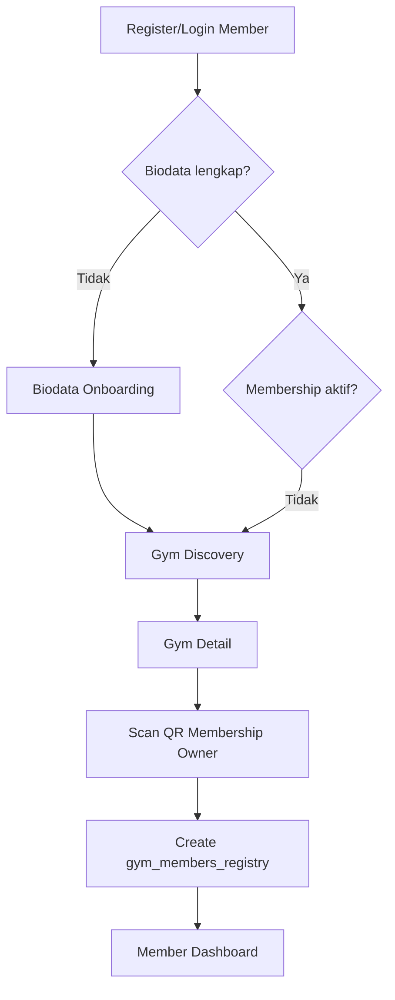

### Active Member

1. Login.
2. `activeMembershipProvider` mengambil active membership dari Firestore.
3. Member masuk ke dashboard aktif.
4. Member melihat progress membership, sisa hari, check-in terakhir, kelas aktif, dan aktivitas.
5. Member dapat menampilkan QR check-in harian.
6. Owner men-scan QR untuk mencatat visit dan attendance log.

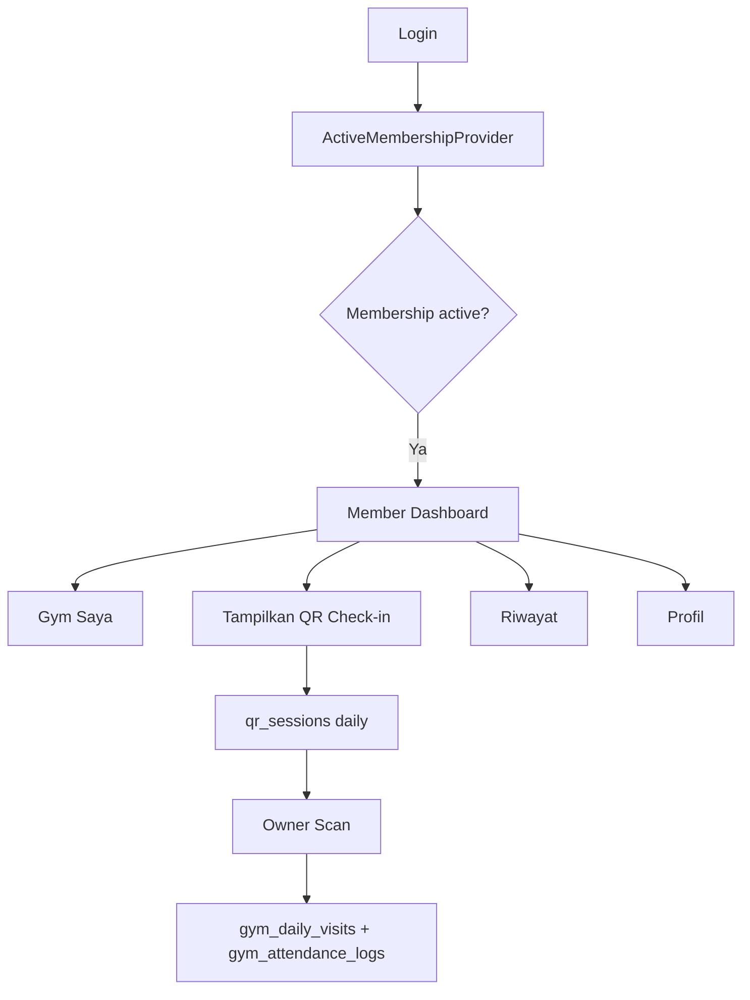

### Owner

1. Register/login sebagai owner.
2. Jika belum punya gym tenant, diarahkan ke setup wizard.
3. Setelah gym dibuat, owner masuk dashboard.
4. Owner mengelola harga, peralatan, kelas, rank, member, riwayat, dan profil.
5. Owner menampilkan QR membership agar member dapat aktivasi.
6. Owner men-scan QR harian member untuk check-in.

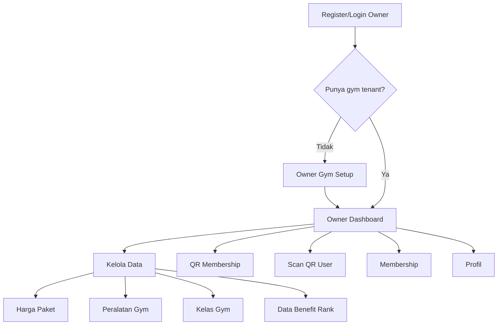

## 12. Use Case Mapping

Actor aktual:

- Member
- Active Member
- Daily Visitor
- Owner
- Firebase Auth
- Firestore

| Actor | Use Case | Preconditions | Main Flow | Output | Related Screen | Collection |
| --- | --- | --- | --- | --- | --- | --- |
| Member | Register | Email belum terdaftar | Isi nama, email, password, pilih role member | User auth dan profile dibuat | `RegisterScreen` | `user_accounts_global` |
| Owner | Register | Email belum terdaftar | Isi form owner | User owner dibuat | `RegisterScreen` | `user_accounts_global` |
| Member/Owner | Login | Akun ada | Email/password ke Firebase Auth | Session authenticated | `LoginScreen` | `user_accounts_global` |
| Member | Lengkapi biodata | Authenticated member | Isi data fisik/goal | Biodata tersimpan | `BiodataOnboardingScreen` | `user_biodata_profiles` |
| Member | Cari gym | Biodata lengkap | Buka discovery | List gym aktif | `GymDiscoveryScreen` | `gym_tenants` |
| Member | Aktivasi membership | Ada QR owner | Scan QR membership | Membership aktif 30 hari | `MemberScanMembershipScreen` | `gym_members_registry` |
| Active Member | Tampilkan QR harian | Membership aktif | Generate QR 5 menit | QR session | `DailyQrScreen` | `qr_sessions` |
| Owner | Scan daily QR | Punya gym | Scan QR member | Check-in tercatat | `OwnerScanQrScreen` | `gym_daily_visits`, `gym_attendance_logs` |
| Owner | Kelola peralatan | Punya gym | Create/update/delete | Data peralatan | `OwnerEquipmentScreen` | `gym_equipments` |
| Owner | Kelola kelas | Punya gym | Create/update/delete | Data kelas | `OwnerClassScreen` | `gym_classes_catalog` |
| Owner | Kelola rank | Punya gym | Create/update/delete | Data rank | `OwnerRankScreen` | `gym_master_ranks` |
| Owner | Update harga | Punya gym | Edit harga | Harga gym berubah | `OwnerPriceScreen` | `gym_tenants` |
| Semua | Ubah tema | App berjalan | Pilih light/dark/system | ThemeMode tersimpan | `ThemeSettingsScreen` | SharedPreferences |

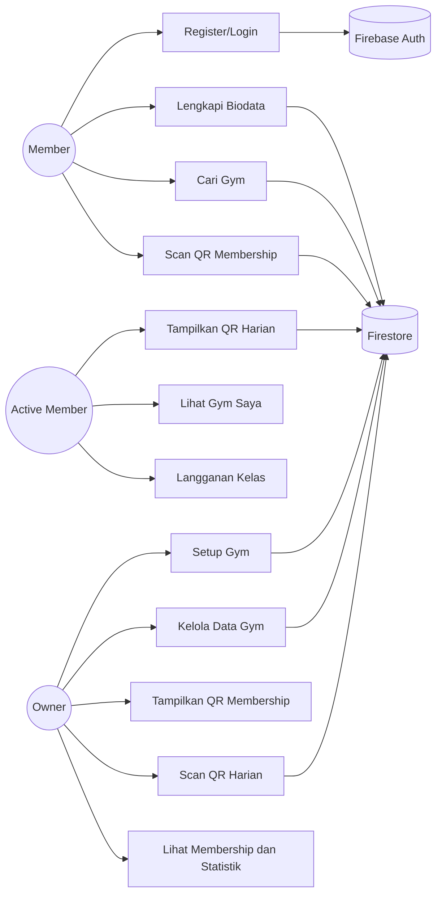

## 13. Activity Diagram Source

### 13.1 Register Member

- Initial state: user berada di Register.
- Action: isi nama, email, password, role member.
- Validation: Firebase Auth memvalidasi email/password.
- Decision: sukses atau error.
- Success: buat document `user_accounts_global`.
- Failure: tampilkan inline error.
- Final state: authenticated dan lanjut flow member.

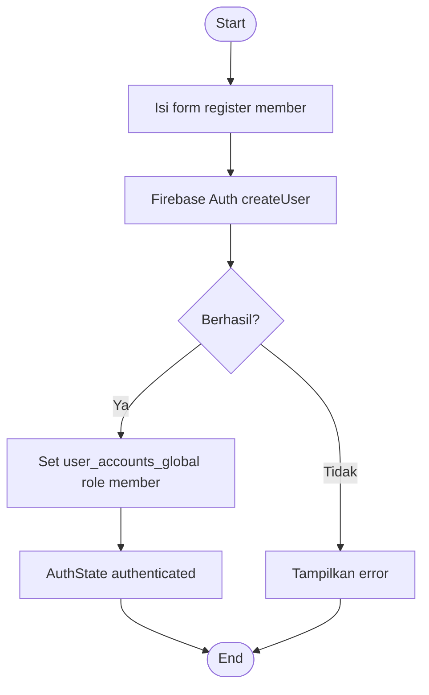

### 13.2 Login

- Initial state: unauthenticated.
- Action: isi email dan password.
- Validation: Firebase Auth.
- Success: fetch profile Firestore.
- Failure: email/password/general error.

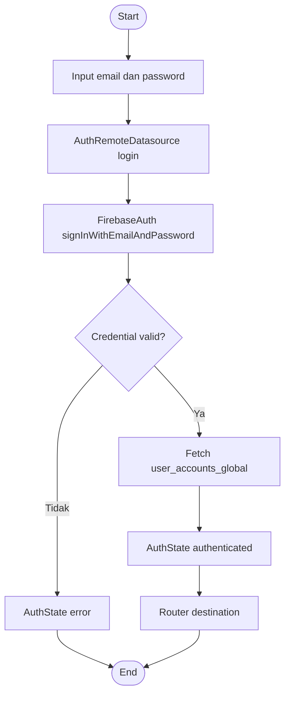

### 13.3 Biodata Completion

- Initial state: authenticated member, `user_has_completed_biodata=false`.
- Action: isi biodata.
- Validation: form screen dan provider.
- Success: simpan biodata dan update user flag.
- Failure: provider error.

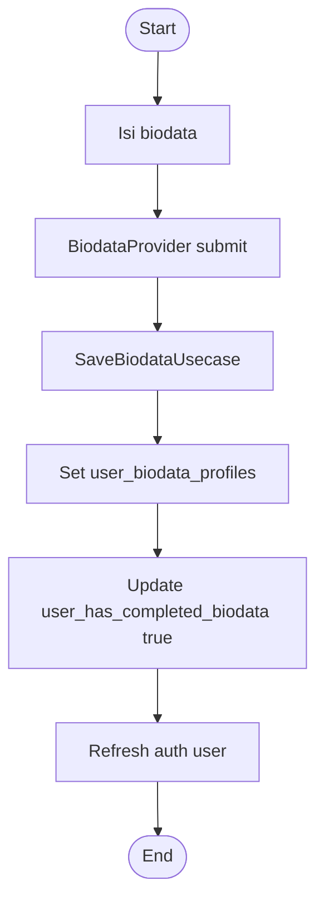

### 13.4 Gym Discovery

- Initial state: member sudah biodata, belum active membership.
- Action: buka `/member/home`.
- Validation: `userFlowProvider` memilih discovery.
- Success: `gymListProvider` stream gym aktif.
- Failure: tampilkan error/empty state.

### 13.5 Daily Check-in

- Initial state: active member memiliki `mem_gym_id`.
- Action: member generate QR harian.
- Validation: QR expiry 5 menit dan `qr_is_used=false`.
- Success: owner scan, create daily visit dan attendance log.
- Failure: QR kadaluarsa, sudah dipakai, atau gym tidak cocok.

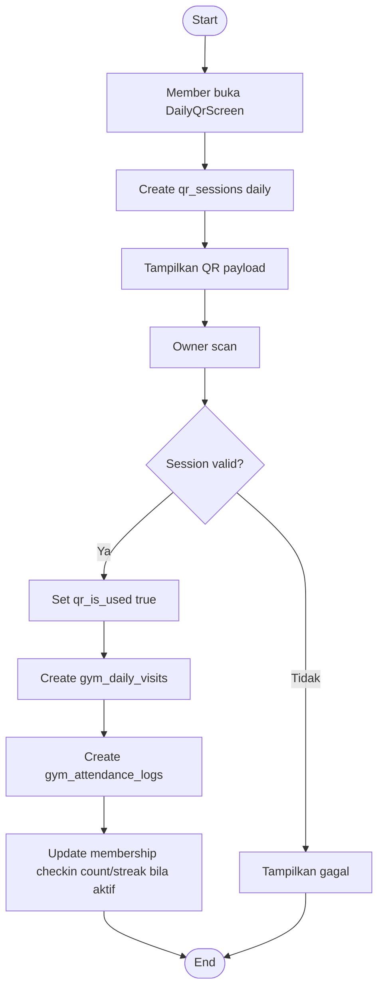

### 13.6 Membership Activation

- Initial state: member login dan melihat QR membership owner.
- Action: scan QR.
- Validation: payload `membership_activation`, belum ada active membership di gym tersebut.
- Success: create `gym_members_registry` dan attendance log category `membership`.
- Failure: QR invalid atau membership sudah aktif.

### 13.7 Owner Gym Setup Wizard

- Initial state: owner authenticated tanpa gym tenant.
- Action: isi nama gym, deskripsi, kota, alamat, harga, fasilitas, jam operasional.
- Success: create `gym_tenants`, invalidate `ownerGymProvider`.
- Failure: error provider.

### 13.8 Equipment CRUD

- Initial: owner punya gym.
- Action: tambah/edit/hapus peralatan.
- Validation: minimal data form.
- Success: write `gym_equipments`.
- Failure: snackbar/error UI.

### 13.9 Class CRUD

- Initial: owner punya gym.
- Action: tambah/edit/hapus kelas.
- Success: write `gym_classes_catalog`.

### 13.10 Benefit Rank CRUD

- Initial: owner punya gym.
- Action: tambah/edit/hapus rank.
- Decision: `rank_min_points_threshold` dipakai sebagai threshold dan prioritas.
- Success: write `gym_master_ranks`.

### 13.11 QR Scan

- Initial: scanner dibuka.
- Action: camera membaca barcode.
- Decision: payload valid/invalid.
- Success: proses sesuai `type`.
- Failure: snackbar/error message.

### 13.12 Logout

- Initial: authenticated.
- Action: tap logout.
- Success: Firebase Auth signOut, theme reset ke light, auth state unauthenticated.

### 13.13 Dark Mode Change

- Initial: app berjalan.
- Action: pilih theme mode.
- Success: SharedPreferences `app_theme_mode` berubah, UI memakai `ThemeMode`.

## 14. Sequence Diagram Source

### 14.1 Member Login

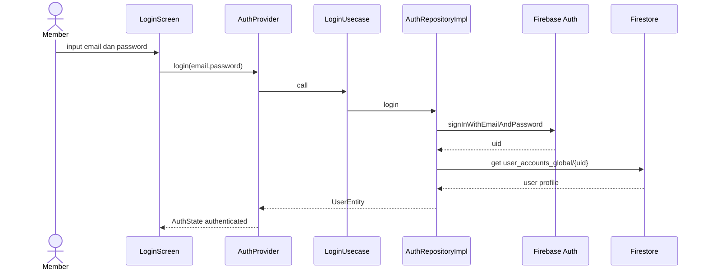

### 14.2 Member Register

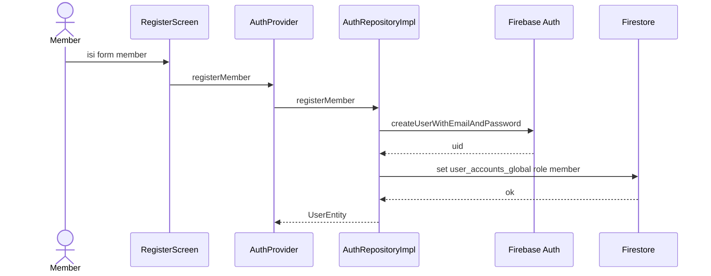

### 14.3 Owner Register

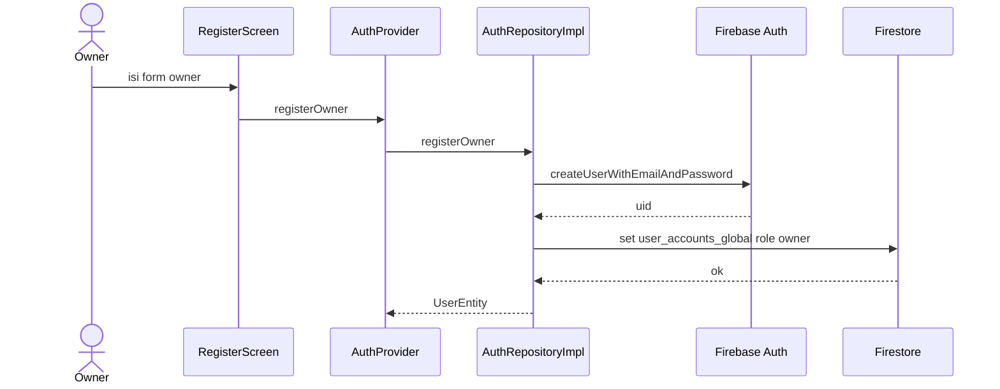

### 14.4 Daily QR Check-in

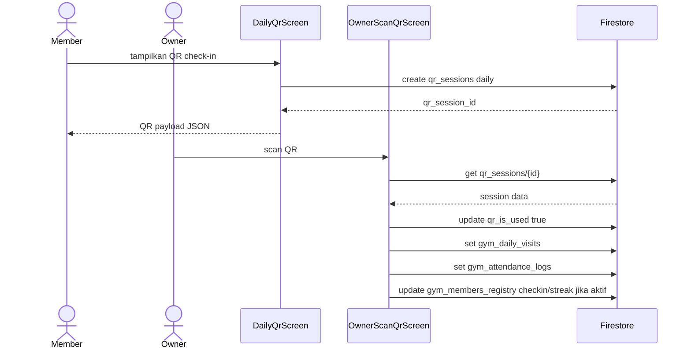

### 14.5 Membership Activation QR

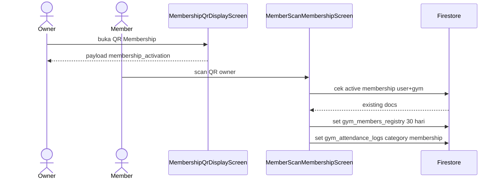

### 14.6 Equipment Create

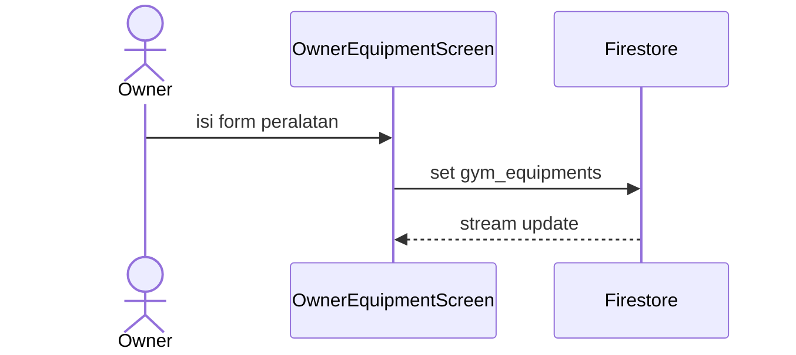

### 14.7 Class Create

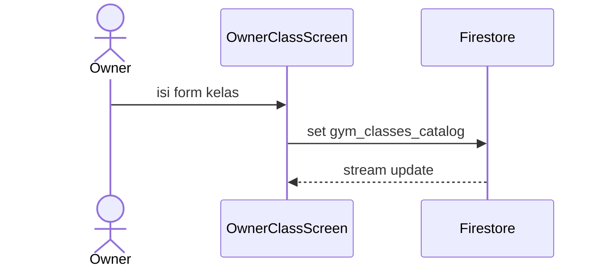

### 14.8 Dashboard Data Loading

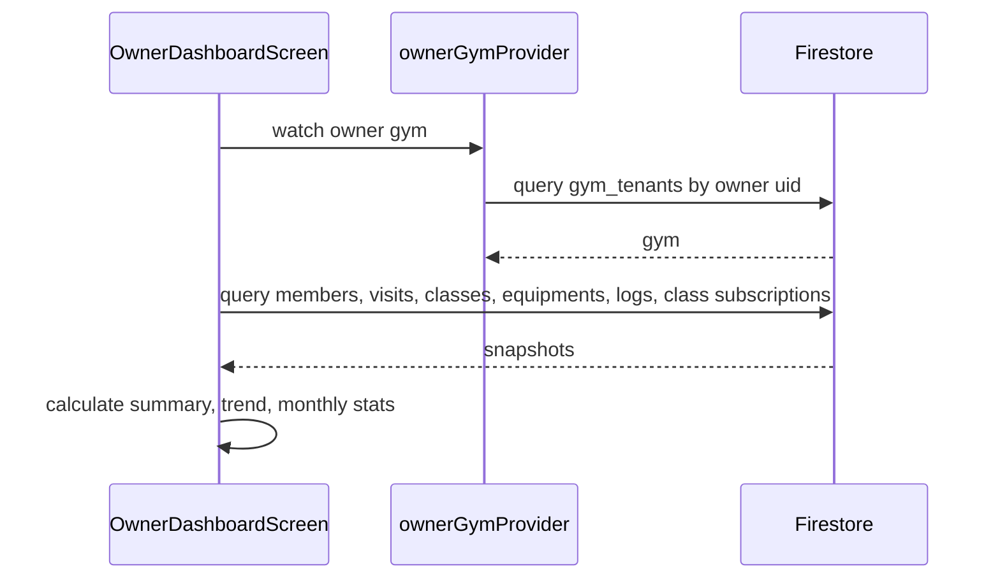

### 14.9 Theme Change

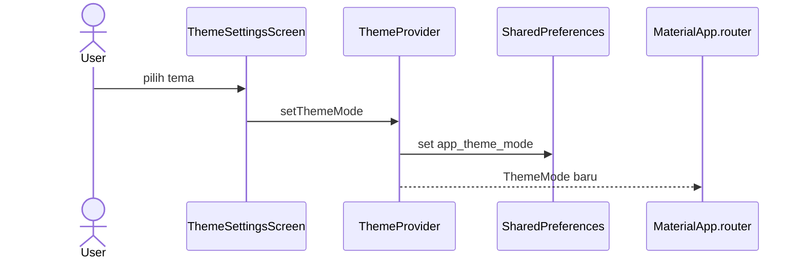

## 15. ERD and Firestore Data Model

Firestore adalah document database. Relasi berikut adalah relasi logis melalui field ID, bukan foreign key SQL.

| Collection | Purpose | Main Fields | Read By | Written By | Related Collection | Status |
| --- | --- | --- | --- | --- | --- | --- |
| `user_accounts_global` | Profil global user auth | `user_uid_auth`, `user_full_name`, `user_email_address`, `user_global_role`, `user_has_completed_biodata`, `user_is_active` | Auth, membership owner, history | Auth register, biodata detail | `user_biodata_profiles`, `gym_members_registry` | Active |
| `user_biodata_profiles` | Biodata member | `bio_user_uid`, `bio_full_name`, `bio_birth_date`, `bio_weight`, `bio_height`, `bio_gender`, `bio_goal_type` | Biodata detail | Biodata onboarding/detail | `user_accounts_global` | Active |
| `gym_tenants` | Data gym owner | `gt_id_key`, `gt_owner_uid`, `gt_name_title`, `gt_image`, prices, location, facilities | Discovery, dashboard, membership | Owner setup/edit/price | equipment, class, membership | Active |
| `gym_members_registry` | Data membership member di gym | `mem_user_uid`, `mem_gym_id`, status, period, points, streak, checkin | active membership, owner membership, dashboard | QR membership activation, owner scan update | `user_accounts_global`, `gym_tenants` | Active |
| `gym_daily_visits` | Visit/check-in harian | `daily_visit_user_uid`, `daily_visit_gym_id`, `daily_visit_checkin_at`, status | dashboard, activity, history | Owner scan daily QR | `qr_sessions`, `gym_tenants`, users | Active |
| `gym_attendance_logs` | Log aktivitas attendance | `log_user_uid`, `log_gym_id`, `log_category_type`, `log_recorded_at` | dashboard, activity, history | QR flows | users, gym, class | Active |
| `qr_sessions` | Session QR harian | `qr_type`, related ids, generated/expired, used | Owner scan | Daily QR generator | `gym_daily_visits` | Active for daily |
| `gym_equipments` | Data alat gym | `equip_parent_gym_id`, name, category, image URL, instruction | owner/member gym pages | owner equipment CRUD | `gym_tenants` | Active |
| `gym_classes_catalog` | Data kelas gym | class id, parent gym, title, price, schedule, sessions | owner/member gym pages, dashboard | owner class CRUD, subscription updates subscriber count | `gym_class_subscriptions` | Active |
| `gym_class_subscriptions` | Subscription kelas member | user, gym, class, status, remaining sessions | dashboard, member activity, owner dashboard | Member class subscription | `gym_classes_catalog` | Active |
| `gym_master_ranks` | Master benefit rank | rank title, min points, benefits, priority | owner rank, owner membership | owner rank CRUD | `gym_members_registry` | Active, rank automation partial |
| `gym_reviews` | Review gym | - | - | - | - | Not found in current implementation |

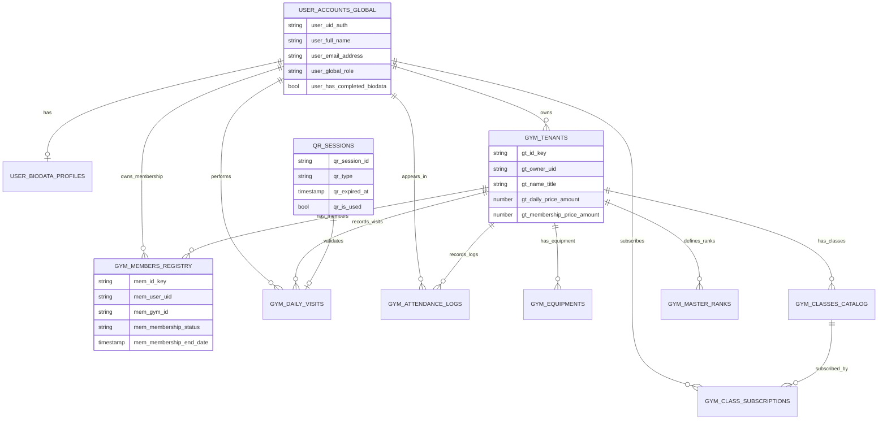

## 16. Database Field Dictionary

### Collection: `user_accounts_global`

| Field | Type | Required | Purpose | Example | Used In File |
| --- | --- | --- | --- | --- | --- |
| `user_uid_auth` | String | Ya | UID Firebase Auth | `uid123` | `user_model.dart` |
| `user_full_name` | String | Ya | Nama pengguna | `Budi Santoso` | `user_model.dart`, owner membership |
| `user_email_address` | String | Ya | Email login | `budi@mail.com` | `user_model.dart` |
| `user_global_role` | String | Ya | Role `member` atau `owner` | `member` | `user_model.dart` |
| `user_has_completed_biodata` | bool | Ya | Flag biodata member | `true` | `user_flow_provider.dart` |
| `user_is_active` | bool | Ya | Status aktif akun | `true` | `user_model.dart` |

### Collection: `user_biodata_profiles`

| Field | Type | Required | Purpose | Example | Used In File |
| --- | --- | --- | --- | --- | --- |
| `bio_user_uid` | String | Ya | UID user | `uid123` | `biodata_model.dart` |
| `bio_full_name` | String | Ya | Nama biodata | `Budi` | `biodata_model.dart` |
| `bio_birth_date` | Timestamp | Ya | Tanggal lahir | `Timestamp` | `biodata_model.dart` |
| `bio_weight` | Number | Ya | Berat badan | `70` | `biodata_model.dart` |
| `bio_height` | Number | Ya | Tinggi badan | `175` | `biodata_model.dart` |
| `bio_daily_activity_frequency` | String | Ya | Frekuensi aktivitas | `medium` | `biodata_model.dart` |
| `bio_gender` | String | Ya | Gender | `male` | `biodata_model.dart` |
| `bio_goal_type` | String | Ya | Tujuan latihan | `fitness` | `biodata_model.dart` |
| `bio_medical_notes` | String | Tidak | Catatan medis | `-` | `biodata_model.dart` |
| `bio_updated_at` | Timestamp | Ya | Waktu update | server timestamp | `biodata_model.dart` |

### Collection: `gym_tenants`

| Field | Type | Required | Purpose | Example | Used In File |
| --- | --- | --- | --- | --- | --- |
| `gt_id_key` | String | Ya | ID gym | `gym001` | `gym_tenant_model.dart` |
| `gt_owner_uid` | String | Ya | UID owner | `owner123` | `gym_tenant_provider.dart` |
| `gt_name_title` | String | Ya | Nama gym | `Gym Twice` | dashboard, discovery |
| `gt_image` | String | Tidak | URL gambar gym | `https://...` | dashboard member/owner |
| `gt_location` | String | Ya | Alamat | `Jl. Kemang` | discovery/detail |
| `gt_city_name` | String | Ya | Kota | `Jakarta` | discovery |
| `gt_rate` | Number | Tidak | Rating gym | `4.5` | model |
| `gt_description_text` | String | Tidak | Deskripsi gym | `Gym premium` | detail/setup |
| `gt_daily_price_amount` | Number | Ya | Harga harian | `25000` | price/detail/dashboard |
| `gt_membership_price_amount` | Number | Ya | Harga membership | `250000` | price/detail/dashboard |
| `gt_available_facilities` | Array String | Tidak | Fasilitas | `["Locker"]` | setup/detail |
| `gt_is_active` | bool | Ya | Gym aktif di discovery | `true` | `GymTenantRemoteDatasource` |
| `gt_operational_hours` | Map | Tidak | Jam operasional | `{info:"08-22"}` | setup/model |
| `gt_created_at` | Timestamp | Ya | Waktu dibuat | server timestamp | model |

### Collection: `gym_members_registry`

| Field | Type | Required | Purpose | Example | Used In File |
| --- | --- | --- | --- | --- | --- |
| `mem_id_key` | String | Ya | ID membership | `mem001` | `membership_model.dart` |
| `mem_user_uid` | String | Ya | UID member | `uid123` | active membership, owner membership |
| `mem_gym_id` | String | Ya | ID gym | `gym001` | active membership |
| `mem_membership_type` | String | Ya | Jenis membership | `monthly` | QR membership |
| `mem_membership_status` | String | Ya | Status membership | `active` | routing/member list |
| `mem_current_points_balance` | Number | Ya | Poin member | `0` | dashboard/rank display |
| `mem_streak_consecutive_days` | Number | Ya | Streak check-in | `3` | dashboard |
| `mem_join_timestamp` | Timestamp | Ya | Tanggal join | Timestamp | dashboard owner |
| `mem_membership_start_date` | Timestamp | Tidak | Awal periode | Timestamp | dashboard member |
| `mem_membership_end_date` | Timestamp | Tidak | Akhir periode | Timestamp | dashboard member |
| `mem_current_rank_id` | String | Tidak | ID rank saat ini | `rank001` | owner membership |
| `mem_total_checkin_count` | Number | Ya | Total check-in | `12` | dashboard |
| `mem_last_checkin_at` | Timestamp | Tidak | Check-in terakhir | Timestamp | dashboard |
| `mem_is_frozen` | bool | Ya | Status freeze | `false` | owner membership |
| `mem_created_by_owner_uid` | String | Tidak | UID owner pembuat membership | `owner123` | QR membership |

### Collection: `gym_daily_visits`

| Field | Type | Required | Purpose | Example | Used In File |
| --- | --- | --- | --- | --- | --- |
| `daily_visit_id_key` | String | Ya | ID visit | `visit001` | `owner_scan_qr_screen.dart` |
| `daily_visit_user_uid` | String | Ya | UID user | `uid123` | activity/history |
| `daily_visit_gym_id` | String | Ya | ID gym | `gym001` | dashboard/history |
| `daily_visit_checkin_at` | Timestamp | Ya | Waktu check-in | server timestamp | dashboard/history |
| `daily_visit_payment_status` | String | Ya | Status pembayaran | `paid` | QR scan |
| `daily_visit_qr_session_id` | String | Ya | ID QR session | `qr001` | QR scan |
| `daily_visit_checkout_at` | Timestamp/null | Tidak | Waktu checkout | null | QR scan |
| `daily_visit_validated_by_owner` | String | Ya | UID owner validator | `owner123` | QR scan |
| `daily_visit_status` | String | Ya | Status visit | `checked_in` | activity/history |

### Collection: `gym_attendance_logs`

| Field | Type | Required | Purpose | Example | Used In File |
| --- | --- | --- | --- | --- | --- |
| `log_id_key` | String | Ya | ID log | `log001` | QR screens |
| `log_member_id` | String | Tidak | ID membership jika ada | `mem001` | QR membership |
| `log_gym_id` | String | Ya | ID gym | `gym001` | dashboard/history |
| `log_category_type` | String | Ya | `daily`, `membership`, `class` | `daily` | dashboard/activity |
| `log_reference_class_id` | String | Tidak | ID kelas jika class | `class001` | activity |
| `log_recorded_at` | Timestamp | Ya | Waktu log | server timestamp | dashboard/activity |
| `log_user_uid` | String | Ya | UID member | `uid123` | activity/history |
| `log_qr_session_id` | String | Tidak | QR session | `qr001` | QR daily |
| `log_validated_by_owner_uid` | String | Tidak | UID owner validator | `owner123` | QR screens |
| `log_device_platform` | String | Ya | Platform | `mobile` | QR screens |

### Collection: `qr_sessions`

| Field | Type | Required | Purpose | Example | Used In File |
| --- | --- | --- | --- | --- | --- |
| `qr_session_id` | String | Ya | ID QR | `qr001` | `daily_qr_screen.dart` |
| `qr_type` | String | Ya | Jenis QR | `daily` | QR screens |
| `qr_related_user_uid` | String | Ya | UID member | `uid123` | QR daily |
| `qr_related_gym_id` | String | Ya | ID gym | `gym001` | QR daily |
| `qr_related_class_id` | String | Tidak | ID kelas | empty | QR daily |
| `qr_generated_at` | Timestamp | Ya | Waktu dibuat | Timestamp | QR daily |
| `qr_expired_at` | Timestamp | Ya | Expiry | +5 menit | owner scanner |
| `qr_is_used` | bool | Ya | Sekali pakai | `false` | owner scanner |

### Collection: `gym_equipments`

| Field | Type | Required | Purpose | Example | Used In File |
| --- | --- | --- | --- | --- | --- |
| `equip_id_key` | String | Ya | ID alat | `equip001` | equipment screens |
| `equip_parent_gym_id` | String | Ya | ID gym | `gym001` | owner/member list |
| `equip_name_label` | String | Ya | Nama alat | `Treadmill` | equipment screens |
| `equip_image_storage_url` | String | Tidak | URL gambar alat | `https://...` | owner/member equipment |
| `equip_usage_instruction_text` | String | Tidak | Instruksi penggunaan | `Gunakan...` | detail modal |
| `equip_tutorial_video_link` | String | Tidak | Link video | `https://...` | detail modal |
| `equip_is_active_status` | bool | Ya | Status alat | `true` | owner data |
| `equip_created_at` | Timestamp | Ya | Waktu dibuat | server timestamp | owner dashboard |
| `equip_last_updated_at` | Timestamp | Ya | Waktu update | server timestamp | owner equipment |
| `equip_category_type` | String | Tidak | Jenis/kategori alat | `cardio` | owner/member equipment |
| `equip_total_usage_count` | Number | Ya | Jumlah penggunaan | `0` | repository |

### Collection: `gym_classes_catalog`

| Field | Type | Required | Purpose | Example | Used In File |
| --- | --- | --- | --- | --- | --- |
| `class_id_key` | String | Ya | ID kelas | `class001` | class screens |
| `class_parent_gym_id` | String | Ya | ID gym | `gym001` | owner/member class |
| `class_title_name` | String | Ya | Nama kelas | `Yoga Class` | class screens |
| `class_pricing_amount` | Number | Ya | Harga kelas | `50000` | class screens |
| `class_schedule_text` | String | Ya | Jadwal | `Selasa, 18.00` | class screens |
| `class_session_count` | Number | Ya | Jumlah sesi | `8` | subscription |
| `class_is_personal_trainer` | bool | Ya | Kelas personal trainer | `false` | owner class |
| `class_description_text` | String | Tidak | Deskripsi | `Latihan...` | member modal |
| `class_thumbnail_image_url` | String | Tidak | Thumbnail kelas | `https://...` | dashboard member |
| `class_max_capacity` | Number | Ya | Kapasitas | `20` | owner class |
| `class_current_subscribers` | Number | Ya | Subscriber aktif | `3` | subscription transaction |
| `class_is_active` | bool | Ya | Status aktif | `true` | class screens |
| `class_created_at` | Timestamp | Partial | Dipakai statistik, tetapi tidak selalu ditulis pada semua create path | server timestamp | owner dashboard |

### Collection: `gym_class_subscriptions`

| Field | Type | Required | Purpose | Example | Used In File |
| --- | --- | --- | --- | --- | --- |
| `class_sub_id_key` | String | Ya | ID subscription | `sub001` | `member_my_gym_screen.dart` |
| `class_sub_user_uid` | String | Ya | UID member | `uid123` | member dashboard/activity |
| `class_sub_gym_id` | String | Ya | ID gym | `gym001` | owner dashboard |
| `class_sub_class_id` | String | Ya | ID kelas | `class001` | dashboard |
| `class_sub_status` | String | Ya | Status | `active` | dashboard |
| `class_sub_created_at` | Timestamp | Ya | Waktu subscribe | server timestamp | dashboard |
| `class_sub_remaining_sessions` | Number | Ya | Sisa sesi | `8` | subscription |

### Collection: `gym_master_ranks`

| Field | Type | Required | Purpose | Example | Used In File |
| --- | --- | --- | --- | --- | --- |
| `rank_id_key` | String | Ya | ID rank | `rank001` | owner rank |
| `rank_parent_gym_id` | String | Ya | ID gym | `gym001` | owner rank/membership |
| `rank_title_name` | String | Ya | Nama rank | `Silver` | owner rank |
| `rank_min_points_threshold` | Number | Ya | Minimal poin | `100` | owner membership |
| `rank_benefit_description_list` | Array String | Ya | List benefit | `["Diskon"]` | owner rank |
| `rank_badge_image_url` | String | Tidak | URL badge | empty | owner rank |
| `rank_priority_order` | Number | Ya | Urutan prioritas; saat ini disamakan dengan min points | `100` | owner rank |
| `rank_is_active` | bool | Ya | Status aktif rank | `true` | owner membership |

## 17. QR System Mapping

QR aktif memakai payload JSON string. Generator QR membuat payload, scanner membaca string, decode JSON, lalu menjalankan validasi dan efek Firestore.

| QR Type | Generated By | Scanned By | Payload | Validation | Firestore Effect | Status |
| --- | --- | --- | --- | --- | --- | --- |
| `daily` | `DailyQrScreen` | `OwnerScanQrScreen` | `{type,daily qrSessionId,userId,gymId,generatedAt}` | Session ada, belum dipakai, belum expired, type daily | update `qr_sessions`, create `gym_daily_visits`, create `gym_attendance_logs`, update membership check-in/streak | Active |
| `membership_activation` | `MembershipQrDisplayScreen` | `MemberScanMembershipScreen` | `{type,gymId,ownerId,generatedAt}` | Type benar, user login, belum punya active membership pada gym | create `gym_members_registry`, create `gym_attendance_logs` | Active |
| `class_subscription` | Tidak ditemukan generator lengkap | `OwnerScanQrScreen` mengenali type | Not found in current implementation | Handler lengkap tidak ditemukan | Tidak lengkap | Partial implementation |
| `class_attendance` | Tidak ditemukan generator lengkap | `OwnerScanQrScreen` mengenali type | Not found in current implementation | Handler lengkap tidak ditemukan | Tidak lengkap | Partial implementation |

Kamera scanner memakai `mobile_scanner`. Android manifest utama saat ini tidak menampilkan permission `android.permission.CAMERA` secara eksplisit; plugin dapat menambahkan kebutuhan permission, tetapi konfigurasi manifest eksplisit tidak ditemukan di `android/app/src/main/AndroidManifest.xml`.

```mermaid
sequenceDiagram
    actor Member
    actor Owner
    participant QR as DailyQrScreen
    participant FS as Firestore
    participant Scan as OwnerScanQrScreen
    Member->>QR: Minta QR harian
    QR->>FS: set qr_sessions expired 5 menit
    QR-->>Member: QrImageView payload daily
    Owner->>Scan: MobileScanner membaca payload
    Scan->>FS: get qr_sessions
    FS-->>Scan: data session
    alt valid
        Scan->>FS: update qr_is_used true
        Scan->>FS: set gym_daily_visits
        Scan->>FS: set gym_attendance_logs
    else invalid
        Scan-->>Owner: tampilkan pesan gagal
    end
```

## 18. Authentication Mapping

Auth memakai Firebase Auth untuk credential dan Firestore `user_accounts_global` untuk profile role. `AuthNotifier` melakukan session check saat provider dibangun. Error Firebase dipetakan di `AuthRepositoryImpl` dan sebagian dipecah menjadi `emailError`, `passwordError`, atau `generalError` di `AuthNotifier`.

Alur penting:

- Register member: `createUserWithEmailAndPassword`, lalu `user_global_role=member`.
- Register owner: `createUserWithEmailAndPassword`, lalu `user_global_role=owner`.
- Login: `signInWithEmailAndPassword`, lalu fetch profile.
- Logout: `signOut`, reset `themeProvider` ke `ThemeMode.light`, auth state unauthenticated.
- Role routing: `userFlowProvider` dan `GoRouter.redirect`.
- Session persistence: Firebase Auth current user dan provider startup check.

```mermaid
sequenceDiagram
    actor User
    participant App as Flutter App
    participant AuthProvider
    participant Repo as AuthRepositoryImpl
    participant FirebaseAuth
    participant Firestore
    User->>App: login/register/logout
    App->>AuthProvider: panggil action
    AuthProvider->>Repo: usecase/repository
    Repo->>FirebaseAuth: auth operation
    Repo->>Firestore: get/set user profile
    Firestore-->>Repo: profile data
    Repo-->>AuthProvider: UserEntity atau error
    AuthProvider-->>App: AuthState
```

## 19. Riverpod State Mapping

| Provider | File Path | Type | Purpose | Data Source | Watched By Screen |
| --- | --- | --- | --- | --- | --- |
| `sharedPreferencesProvider` | `lib/core/providers/onboarding_provider.dart` | Provider | Inject SharedPreferences | `main.dart` override | onboarding/theme providers |
| `onboardingProvider` | `lib/core/providers/onboarding_provider.dart` | NotifierProvider | Status sudah melihat onboarding | SharedPreferences | router, onboarding |
| `themeProvider` | `lib/core/providers/theme_provider.dart` | NotifierProvider | ThemeMode light/dark/system | SharedPreferences | `main.dart`, settings, auth logout |
| `userFlowProvider` | `lib/core/providers/user_flow_provider.dart` | Provider | Menentukan destination user | auth, ownerGym, activeMembership | router |
| `authProvider` | `lib/features/auth/presentation/providers/auth_provider.dart` | NotifierProvider | AuthState dan user session | Auth usecases/Firebase | login, register, shell, profile |
| `biodataProvider` | `lib/features/biodata/presentation/providers/biodata_provider.dart` | NotifierProvider | Submit biodata | SaveBiodataUsecase | biodata onboarding |
| `gymListProvider` | `lib/features/gym_tenant/presentation/providers/gym_tenant_provider.dart` | StreamProvider | List gym aktif | Firestore via usecase | gym discovery |
| `ownerGymProvider` | `lib/features/gym_tenant/presentation/providers/gym_tenant_provider.dart` | FutureProvider | Gym milik owner | Firestore via usecase | router, owner screens |
| `gymSetupProvider` | `lib/features/gym_tenant/presentation/providers/gym_tenant_provider.dart` | NotifierProvider | State setup gym | CreateGymUsecase | owner setup |
| `activeMembershipProvider` | `lib/features/membership/presentation/providers/active_membership_provider.dart` | FutureProvider | Membership aktif user login | GetActiveMembershipUsecase | router, member dashboard |
| `membershipProvider` | `lib/features/member_dashboard/presentation/providers/membership_provider.dart` | NotifierProvider | State akses lokal `none/member/daily` | Memory only | dashboard onboarding view |

`ref.watch` dipakai untuk reaktif UI. `ref.read` dipakai untuk action seperti login, logout, submit, atau navigasi QR. `FutureProvider` dan `StreamProvider` menghasilkan loading/data/error yang umumnya ditangani melalui `.when`.

## 20. GoRouter and Navigation Mapping

| Route | Screen | Role | Guard / Redirect | Source File |
| --- | --- | --- | --- | --- |
| `/` | `SplashScreen` | Semua | Initial, timer splash | `app_router.dart` |
| `/onboarding` | `OnboardingScreen` | Unauthenticated | Muncul jika belum `has_seen_onboarding` | `app_router.dart` |
| `/login` | `LoginScreen` | Unauthenticated | Blocked jika sudah authenticated | `app_router.dart` |
| `/register` | `RegisterScreen` | Unauthenticated | Blocked jika sudah authenticated | `app_router.dart` |
| `/biodata-onboarding` | `BiodataOnboardingScreen` | Member | Hanya jika member belum biodata | `app_router.dart` |
| `/owner-setup` | `OwnerGymSetupScreen` | Owner | Hanya jika owner belum punya gym | `app_router.dart` |
| `/owner/home` | `OwnerDashboardScreen` | Owner | Hanya `ownerDashboard` | `app_router.dart` |
| `/owner/manage` | `OwnerManageDataScreen` | Owner | Owner shell | `app_router.dart` |
| `/owner/scan` | `OwnerScanPlaceholderScreen` | Owner | Owner shell | `app_router.dart` |
| `/owner/membership` | `OwnerMembershipScreen` | Owner | Owner shell | `app_router.dart` |
| `/owner/profile` | `OwnerProfileScreen` | Owner | Owner shell | `app_router.dart` |
| `/member/home` | `MemberDashboardScreen` atau `GymDiscoveryScreen` | Member | Dashboard jika active membership, discovery jika belum | `app_router.dart` |
| `/member/my-gym` | `MemberMyGymScreen` | Member | Member shell; content terkunci bila tidak aktif | `app_router.dart` |
| `/member/scan` | `MemberScanPlaceholderScreen` | Member | Member shell | `app_router.dart` |
| `/member/activity` | `MemberActivityScreen` | Member | Member shell | `app_router.dart` |
| `/member/profile` | `MemberProfileScreen` | Member | Member shell | `app_router.dart` |

`StatefulShellRoute.indexedStack` menjaga state branch bottom navigation. Owner dan member punya shell terpisah. Route CRUD detail banyak menggunakan `Navigator.push(MaterialPageRoute(...))`, bukan GoRoute named route.

## 21. CRUD Mapping

### Equipment

- Create: `OwnerEquipmentScreen` membuat document `gym_equipments`.
- Read: stream query `equip_parent_gym_id`.
- Update: update document existing.
- Delete: delete document.
- Form fields: nama, kategori, instruksi, URL gambar, link video.
- Firestore collection: `gym_equipments`.
- Member read-only view: `MemberMyGymScreen`.

### Classes

- Create: `OwnerClassScreen` membuat document `gym_classes_catalog`.
- Read: stream query `class_parent_gym_id`.
- Update: update document existing.
- Delete: delete document.
- Form fields: judul, harga, jadwal, jumlah sesi, deskripsi, kapasitas, personal trainer.
- Firestore collection: `gym_classes_catalog`.
- Member subscription: `MemberMyGymScreen` membuat `gym_class_subscriptions` dan increment `class_current_subscribers`.

### Rank Benefits

- Create: `OwnerRankScreen` membuat document `gym_master_ranks`.
- Read: stream query `rank_parent_gym_id`.
- Update: update document existing.
- Delete: delete document.
- Form fields: nama rank, minimal poin, daftar benefit.
- Firestore collection: `gym_master_ranks`.
- Catatan: `rank_priority_order` saat ini diisi sama dengan minimal poin.

### Package Pricing

- Update: `OwnerPriceScreen` mengubah `gt_daily_price_amount` dan `gt_membership_price_amount`.
- Read: dari `ownerGymProvider`.
- Firestore collection: `gym_tenants`.
- Tidak ada payment gateway.

### Gym Profile

- Create: `OwnerGymSetupScreen` membuat document `gym_tenants`.
- Read: `ownerGymProvider`, discovery, dashboard.
- Update: `OwnerEditGymScreen`.
- Delete: Not found in current implementation.

## 22. Dashboard Statistics Mapping

| Statistic | Screen | Query Source | Filter | Calculation | Fallback |
| --- | --- | --- | --- | --- | --- |
| Total member | Owner dashboard | `gym_members_registry` | `mem_gym_id == gymId` | `docs.length` | 0 |
| Check-in hari ini | Owner dashboard | `gym_daily_visits` | `daily_visit_gym_id == gymId` lalu tanggal hari ini | Count timestamp | 0 |
| Total kelas | Owner dashboard | `gym_classes_catalog` | `class_parent_gym_id == gymId` | `docs.length` | 0 |
| Total peralatan | Owner dashboard | `gym_equipments` | `equip_parent_gym_id == gymId` | `docs.length` | 0 |
| Trend kemarin | Owner dashboard | Members/visits/classes/equipment | timestamp hari ini vs kemarin | Selisih | `Belum ada perubahan` |
| Aktivitas terbaru | Owner dashboard | visits, members, logs, class subscriptions | gymId dan limit | Merge/sort timestamp | Empty state |
| Statistik bulanan check-in | Owner dashboard | `gym_daily_visits` | 6 bulan terakhir | Count per bulan | 0 |
| Statistik bulanan membership | Owner dashboard | `gym_members_registry` | 6 bulan terakhir | Count per bulan | 0 |
| Active membership progress | Member dashboard | `gym_members_registry` | active membership user | Hari tersisa dan progress tanggal | 0 |
| Poin | Member dashboard | `mem_current_points_balance` | membership aktif | value field | 0 |
| Streak | Member dashboard | `mem_streak_consecutive_days` | membership aktif | value field | 0 |
| Total check-in | Member dashboard | `mem_total_checkin_count` | membership aktif | value field | 0 |
| Check-in terakhir | Member dashboard | visits/logs/membership field | user id | timestamp terbaru | `Belum ada check-in` |
| Kelas aktif | Member dashboard | `gym_class_subscriptions`, `gym_classes_catalog` | active subscription | latest active class | Tidak ditampilkan bila tidak ada |

## 23. Theme and UI Mapping

Theme aplikasi ada di `AppTheme`. Warna brand utama adalah lime `#C0FE39`. Font memakai Montserrat untuk display/headline/title besar dan Inter untuk body/label/title kecil-menengah.

| UI Element | File Path | How to Modify |
| --- | --- | --- |
| Primary color | `lib/core/theme/app_colors.dart` | Ubah `AppColors.primary` |
| Light/dark theme | `lib/core/theme/app_theme.dart` | Ubah `lightTheme` dan `darkTheme` |
| Typography | `lib/core/theme/app_typography.dart` | Ubah mapping Google Fonts |
| Theme persistence | `lib/core/providers/theme_provider.dart` | Ubah key atau mode default |
| AppBar logo | `lib/core/widgets/gymmy_app_bar_logo.dart` | Ubah asset/ukuran logo |
| Shared button | `lib/core/widgets/gymmy_button.dart` | Ubah style button reusable |
| Shared card | `lib/core/widgets/gymmy_card.dart` | Ubah radius/padding/elevation |
| Member top bar | `lib/features/member_dashboard/presentation/widgets/member_top_bar.dart` | Ubah topbar member |
| Owner top bar | `lib/features/owner_dashboard/presentation/widgets/owner_top_bar.dart` | Ubah topbar owner |
| Bottom navigation member | `lib/features/member_dashboard/presentation/screens/member_shell_screen.dart` | Ubah nav item/action |
| Bottom navigation owner | `lib/features/owner_dashboard/presentation/screens/owner_shell_screen.dart` | Ubah nav item/action |
| QR contrast | `daily_qr_screen.dart`, `membership_qr_display_screen.dart` | Ubah warna card/QR text |

## 24. DFD Source

### DFD Level 0

```mermaid
flowchart LR
    Member[Member] --> App[GYMMY App]
    Owner[Owner] --> App
    App --> Auth[Firebase Auth]
    App --> FS[Cloud Firestore]
    Auth --> App
    FS --> App
    App --> Member
    App --> Owner
```

### DFD Level 1

```mermaid
flowchart TD
    Member[Member] --> P1[Auth Process]
    Owner[Owner] --> P1
    P1 --> Auth[(Firebase Auth)]
    P1 --> U[(user_accounts_global)]
    Member --> P2[Profile/Biodata Process]
    P2 --> B[(user_biodata_profiles)]
    Member --> P3[Gym Discovery Process]
    P3 --> G[(gym_tenants)]
    Member --> P4[Membership Process]
    Owner --> P4
    P4 --> M[(gym_members_registry)]
    Member --> P5[QR Process]
    Owner --> P5
    P5 --> Q[(qr_sessions)]
    P5 --> V[(gym_daily_visits)]
    P5 --> L[(gym_attendance_logs)]
    Owner --> P6[CRUD Process]
    P6 --> E[(gym_equipments)]
    P6 --> C[(gym_classes_catalog)]
    P6 --> R[(gym_master_ranks)]
    Member --> P7[Dashboard Process]
    Owner --> P7
    P7 --> M
    P7 --> V
    P7 --> L
    P7 --> S[(gym_class_subscriptions)]
```

## 25. State Transition Mapping

### Member State Transitions

```mermaid
stateDiagram-v2
    [*] --> Unauthenticated
    Unauthenticated --> AuthenticatedIncompleteBiodata: login/register member
    AuthenticatedIncompleteBiodata --> GymDiscovery: biodata saved
    GymDiscovery --> DailyVisitor: daily access selected / partial
    GymDiscovery --> ActiveMember: membership QR scanned
    ActiveMember --> ActiveMember: daily QR check-in
    ActiveMember --> ExpiredMembership: end date passed / no active record
    ExpiredMembership --> GymDiscovery: activeMembershipProvider returns null
    ActiveMember --> Unauthenticated: logout
    GymDiscovery --> Unauthenticated: logout
```

### Owner State Transitions

```mermaid
stateDiagram-v2
    [*] --> Unauthenticated
    Unauthenticated --> AuthenticatedWithoutGymTenant: login/register owner
    AuthenticatedWithoutGymTenant --> SetupWizard: ownerGymProvider returns null
    SetupWizard --> ActiveOwnerDashboard: gym_tenants created
    ActiveOwnerDashboard --> ActiveOwnerDashboard: CRUD data
    ActiveOwnerDashboard --> ActiveOwnerDashboard: scan QR
    ActiveOwnerDashboard --> Unauthenticated: logout
```

## 26. Validation and Error Handling

| Feature | Validation | Error Message | File Path | Failure Behavior |
| --- | --- | --- | --- | --- |
| Login | Firebase email/password | `Incorrect email or password`, `Network connection failed` | `auth_repository_impl.dart`, `auth_provider.dart` | Inline/general error |
| Register | Firebase email, duplicate, weak password | `Email already registered`, `Password too weak` | `auth_repository_impl.dart`, `auth_provider.dart` | Inline/general error |
| Biodata | Form values dan submit provider | `e.toString()` cleaned | `biodata_provider.dart` | State error |
| Owner setup | Required form, create gym | Error provider | `gym_tenant_provider.dart` | State error |
| Equipment form | Input nama/kategori/URL/instruksi | Snackbar/error catch | `owner_equipment_screen.dart` | Form tetap terbuka/error |
| Class form | Input title/harga/jadwal/sesi | Snackbar/error catch | `owner_class_screen.dart` | Form tetap terbuka/error |
| Rank form | Title, min points, benefits | Snackbar/error catch | `owner_rank_screen.dart` | Form tetap terbuka/error |
| Pricing | Parse double harga | fallback `0` jika parse gagal | `owner_price_screen.dart` | Harga bisa menjadi 0 jika input invalid |
| Daily QR | Session exists, unused, unexpired | QR invalid/kadaluarsa/sudah dipakai | `owner_scan_qr_screen.dart` | Scan gagal |
| Membership QR | Type valid, user login, belum aktif | `Kamu sudah memiliki membership aktif...` | `member_scan_membership_screen.dart` | Scan gagal/snackbar |
| Firestore query | try/catch atau snapshot error | `Gagal memuat...` | Banyak screen | Error state |
| Dark mode | SharedPreferences set mode | Not found explicit error | `theme_provider.dart` | Mode tetap sebelumnya |
| Image URL | `Image.network.errorBuilder` | fallback icon | member/owner equipment/dashboard | Gambar fallback |

## 27. Build and Deployment

Perintah umum:

```bash
flutter pub get
flutter analyze
flutter run
flutter build apk --release
```

APK release biasanya berada di:

```text
build/app/outputs/flutter-apk/app-release.apk
```

Catatan deployment:

- Firebase diinisialisasi dari `lib/firebase_options.dart`.
- Project Firebase yang terlihat: `gymmy-saas`.
- Android memakai Google Services plugin di `android/app/build.gradle.kts`.
- File `android/app/google-services.json` ada di project.
- Internet dibutuhkan untuk Firebase Auth, Firestore, gambar URL, dan QR validation.
- Scanner QR membutuhkan akses kamera.
- Android manifest utama tidak menampilkan permission kamera eksplisit; verifikasi permission runtime saat testing perangkat.
- Release signing masih debug signing config sesuai template Flutter (`signingConfigs.getByName("debug")`).

## 28. Testing Checklist

| ID | Role | Feature | Steps | Expected Result | Status |
| --- | --- | --- | --- | --- | --- |
| T01 | Semua | Splash | Jalankan app | Splash muncul lalu redirect | Manual |
| T02 | Semua | Onboarding | Reset pref onboarding, buka app | 3 page onboarding, Lewati/Mulai ke login | Manual |
| T03 | Member | Register | Register role member | User dibuat, masuk biodata | Manual |
| T04 | Owner | Register | Register role owner | User dibuat, masuk owner setup | Manual |
| T05 | Semua | Login | Login credential valid | Masuk sesuai role/flow | Manual |
| T06 | Member | Biodata | Isi semua data | `user_has_completed_biodata=true` | Manual |
| T07 | Member | Gym discovery | Buka member tanpa membership | List gym aktif tampil | Manual |
| T08 | Owner | Setup gym | Isi wizard | Gym tenant dibuat | Manual |
| T09 | Owner | Harga paket | Update harga | Field harga gym berubah | Manual |
| T10 | Owner | Equipment CRUD | Tambah/edit/hapus alat | Stream list update | Manual |
| T11 | Owner | Class CRUD | Tambah/edit/hapus kelas | Stream list update | Manual |
| T12 | Owner | Rank CRUD | Tambah/edit/hapus rank | Stream list update | Manual |
| T13 | Owner | QR membership | Tampilkan QR | QR payload terbaca scanner member | Manual |
| T14 | Member | Scan membership | Scan QR owner | Membership aktif 30 hari | Manual |
| T15 | Member | Daily QR | Tampilkan QR | Countdown 5 menit tampil | Manual |
| T16 | Owner | Scan daily QR | Scan QR member | Visit/log tercatat, QR used | Manual |
| T17 | Member | Gym Saya | Active member buka tab | Equipment/class tampil | Manual |
| T18 | Member | Subscribe kelas | Klik kelas dan langganan | Subscription dibuat | Manual |
| T19 | Owner | Membership list | Cari nama member | Filter hasil sesuai nama/email | Manual |
| T20 | Semua | Dark mode | Ubah tema, logout | Setelah logout kembali light mode | Manual |
| T21 | APK | Build APK | `flutter build apk --release` | APK berhasil dibuat | Manual |
| T22 | Firebase | Data real | Jalankan dengan internet | Dashboard memuat data Firestore | Manual |

## 29. Known Limitations

- Payment gateway tidak ditemukan.
- Review gym tidak ditemukan.
- Offline mode tidak ditemukan.
- Push notification tidak ditemukan.
- QR kelas hanya partial; type dikenali tetapi flow generator/handler lengkap tidak ditemukan.
- Daily access payment masih partial; status pembayaran ditulis `paid` tanpa transaksi nyata.
- Firebase Storage package ada, tetapi alur dominan untuk gambar alat/gym memakai URL.
- Poin dan rank belum terlihat sebagai sistem loyalti otomatis penuh.
- `class_created_at` dipakai untuk statistik kelas, tetapi tidak selalu terlihat ditulis pada semua path create class.
- Android camera permission eksplisit tidak ditemukan di manifest utama.
- Owner CRUD sebagian langsung akses Firestore dari screen, bukan selalu melalui repository/usecase.
- Release signing masih memakai debug config.

## 30. Diagram Creation Guide

| Diagram Needed | README Section to Use | Main Data Source |
| --- | --- | --- |
| ERD | Section 15-16 | Collection table dan field dictionary |
| Use Case Diagram | Section 8 dan 12 | Role matrix dan use case mapping |
| Activity Diagram | Section 13 | Activity mapping per flow |
| Flowchart | Section 11 dan 13 | Member/owner flow |
| Sequence Diagram | Section 14 dan 17-18 | Sequence Mermaid |
| DFD Level 0 | Section 24 | DFD Level 0 source |
| DFD Level 1 | Section 24 | Process dan data store mapping |
| Navigation Map | Section 10 dan 20 | GoRouter route table |
| State Diagram | Section 25 | Member/owner state transitions |
| Architecture Diagram | Section 6 | Layer diagram |
| Database Mapping | Section 15-16 | Firestore mapping |
| Feature Mapping | Section 9 | Complete feature map |
| Role Permission Matrix | Section 8 | Roles and access rights |

## 31. Quick Reference

### 31.1 20 Most Important Files

1. `lib/main.dart`
2. `lib/firebase_options.dart`
3. `lib/core/routing/app_router.dart`
4. `lib/core/routing/route_names.dart`
5. `lib/core/di/injection.dart`
6. `lib/core/providers/user_flow_provider.dart`
7. `lib/core/providers/theme_provider.dart`
8. `lib/core/providers/onboarding_provider.dart`
9. `lib/features/auth/presentation/providers/auth_provider.dart`
10. `lib/features/auth/data/datasources/auth_remote_datasource.dart`
11. `lib/features/gym_tenant/presentation/providers/gym_tenant_provider.dart`
12. `lib/features/membership/presentation/providers/active_membership_provider.dart`
13. `lib/features/owner_dashboard/presentation/screens/owner_dashboard_screen.dart`
14. `lib/features/owner_dashboard/presentation/screens/owner_manage_data_screen.dart`
15. `lib/features/member_dashboard/presentation/widgets/dashboard_member_view.dart`
16. `lib/features/member_dashboard/presentation/screens/member_my_gym_screen.dart`
17. `lib/features/qr_system/presentation/screens/daily_qr_screen.dart`
18. `lib/features/qr_system/presentation/screens/owner_scan_qr_screen.dart`
19. `lib/features/qr_system/presentation/screens/member_scan_membership_screen.dart`
20. `lib/features/onboarding/presentation/screens/onboarding_screen.dart`

### 31.2 20 Most Important Classes

1. `MyApp`
2. `AuthNotifier`
3. `AuthState`
4. `UserEntity`
5. `UserModel`
6. `BiodataEntity`
7. `BiodataModel`
8. `GymTenantEntity`
9. `GymTenantModel`
10. `MembershipEntity`
11. `MembershipModel`
12. `GymSetupNotifier`
13. `ThemeNotifier`
14. `OnboardingNotifier`
15. `OwnerDashboardScreen`
16. `MemberDashboardScreen`
17. `DashboardMemberView`
18. `OwnerScanQrScreen`
19. `DailyQrScreen`
20. `OwnerDataRepository`

### 31.3 20 Most Important Functions / Methods

1. `main()`
2. `initInjection()`
3. `createRouter(ref)`
4. `_destinationPath(dest)`
5. `AuthNotifier.login`
6. `AuthNotifier.registerMember`
7. `AuthNotifier.registerOwner`
8. `AuthNotifier.logout`
9. `AuthRemoteDatasource.login`
10. `AuthRemoteDatasource.registerMember`
11. `AuthRemoteDatasource.registerOwner`
12. `AuthRemoteDatasource.getCurrentUser`
13. `BiodataNotifier.submit`
14. `GymSetupNotifier.submit`
15. `ThemeNotifier.setThemeMode`
16. `OnboardingNotifier.completeOnboarding`
17. `QrSessionRepository.createDailyQrSession`
18. `QrSessionRepository.validateAndConsumeQrSession`
19. `QrSessionRepository.createDailyVisit`
20. `QrSessionRepository.createAttendanceLog`

### 31.4 20 Most Important Collections / Fields

1. `user_accounts_global.user_uid_auth`
2. `user_accounts_global.user_global_role`
3. `user_accounts_global.user_has_completed_biodata`
4. `user_biodata_profiles.bio_user_uid`
5. `gym_tenants.gt_id_key`
6. `gym_tenants.gt_owner_uid`
7. `gym_tenants.gt_name_title`
8. `gym_tenants.gt_daily_price_amount`
9. `gym_tenants.gt_membership_price_amount`
10. `gym_members_registry.mem_user_uid`
11. `gym_members_registry.mem_gym_id`
12. `gym_members_registry.mem_membership_status`
13. `gym_members_registry.mem_membership_end_date`
14. `gym_members_registry.mem_total_checkin_count`
15. `qr_sessions.qr_session_id`
16. `qr_sessions.qr_expired_at`
17. `qr_sessions.qr_is_used`
18. `gym_daily_visits.daily_visit_checkin_at`
19. `gym_attendance_logs.log_category_type`
20. `gym_class_subscriptions.class_sub_remaining_sessions`

### 31.5 20 Common Exam Questions

1. Apa tujuan utama aplikasi GYMMY?
2. Apa perbedaan role member dan owner?
3. Bagaimana aplikasi menentukan user masuk ke dashboard atau discovery?
4. Mengapa `user_has_completed_biodata` penting?
5. Collection apa yang menyimpan profil gym?
6. Bagaimana membership aktif dicek?
7. Bagaimana QR harian dibuat?
8. Mengapa QR harian memiliki expiry?
9. Bagaimana QR dibuat sekali pakai?
10. Apa fungsi `gym_attendance_logs`?
11. Apa perbedaan `gym_daily_visits` dan `gym_attendance_logs`?
12. Apa fungsi `gym_master_ranks`?
13. Mengapa rank automation disebut partial?
14. Bagaimana owner mengelola kelas?
15. Bagaimana member berlangganan kelas?
16. Apa fungsi GoRouter dan StatefulShellRoute?
17. Apa fungsi Riverpod dalam app ini?
18. Apa fungsi GetIt?
19. Bagaimana dark mode disimpan?
20. Apa limitation terbesar dari sistem saat ini?

## 32. Glossary

| Term | Explanation |
| --- | --- |
| Flutter | Framework UI dari Google untuk membuat aplikasi multi-platform. |
| Dart | Bahasa pemrograman yang dipakai Flutter. |
| Widget | Unit UI di Flutter, misalnya button, text, screen. |
| Route | Jalur navigasi aplikasi, misalnya `/login`. |
| Provider | Objek Riverpod yang menyediakan state/data ke UI. |
| Repository | Lapisan akses data yang menyembunyikan detail datasource. |
| Firebase | Platform backend dari Google. |
| Firebase Auth | Layanan login/register/session. |
| Firestore | Database NoSQL document-based dari Firebase. |
| Collection | Kumpulan document di Firestore. |
| Document | Satu record data di Firestore. |
| Field | Key-value di dalam document Firestore. |
| Query | Permintaan data dengan filter, misalnya `where`. |
| Stream | Data async berkelanjutan yang update otomatis. |
| Future | Data async satu kali. |
| async | Penanda fungsi asynchronous. |
| await | Menunggu hasil operasi async. |
| QR payload | Isi data yang dirender menjadi QR, di app ini berupa JSON string. |
| JSON | Format data key-value string yang mudah dikirim/dibaca. |
| CRUD | Create, Read, Update, Delete. |
| APK | File instalasi aplikasi Android. |
| Gradle | Build system Android/Flutter Android. |
| Clean Architecture | Pola pemisahan data, domain, dan presentation. |
| Multi-tenant | Satu aplikasi menangani banyak gym/tenant berbeda. |
| Dark mode | Tema gelap aplikasi. |
| Null safety | Fitur Dart untuk mengurangi error nilai null. |

## Diagram-Ready Summary

Sistem GYMMY terdiri dari dua role utama: member dan owner. Routing dikendalikan oleh kombinasi `authProvider`, `onboardingProvider`, `ownerGymProvider`, `activeMembershipProvider`, dan `userFlowProvider`. Data utama berada di Cloud Firestore dengan relasi logis berbasis UID dan document ID. Fitur owner berpusat pada dashboard dan CRUD data gym, sedangkan fitur member berpusat pada discovery, membership aktif, QR check-in, Gym Saya, dan aktivitas.

## Known Gaps

- QR kelas belum lengkap.
- Payment gateway belum ada.
- Review gym belum ada.
- Offline mode belum ada.
- Poin/rank belum sepenuhnya otomatis.
- Camera permission eksplisit perlu diverifikasi.
- Beberapa screen masih direct Firestore access.

## Assumptions

- Semua field dictionary disusun dari model, repository, provider, dan screen yang ditemukan.
- Field yang dibaca tetapi tidak selalu ditulis ditandai partial.
- Relasi ERD adalah relasi logis Firestore, bukan foreign key SQL.
- Status fitur memakai implementasi kode saat dokumen dibuat.

## Files Inspected

- `pubspec.yaml`
- `lib/main.dart`
- `lib/firebase_options.dart`
- `lib/core/di/injection.dart`
- `lib/core/providers/onboarding_provider.dart`
- `lib/core/providers/theme_provider.dart`
- `lib/core/providers/user_flow_provider.dart`
- `lib/core/routing/app_router.dart`
- `lib/core/routing/route_names.dart`
- `lib/core/theme/app_colors.dart`
- `lib/core/theme/app_theme.dart`
- `lib/core/theme/app_typography.dart`
- `lib/core/widgets/*`
- `lib/features/auth/**`
- `lib/features/biodata/**`
- `lib/features/gym_tenant/**`
- `lib/features/member_dashboard/**`
- `lib/features/membership/**`
- `lib/features/onboarding/**`
- `lib/features/owner_dashboard/**`
- `lib/features/qr_system/**`
- `lib/features/settings/**`
- `lib/features/splash/**`
- `android/app/src/main/AndroidManifest.xml`
- `android/app/build.gradle.kts`
- `assets/logos/*`

## Features Marked Partial

- QR kelas.
- Daily payment.
- Firebase Storage upload.
- Poin otomatis.
- Rank otomatis.
- Checkout gym.
- Statistik kelas berdasarkan `class_created_at`.

## Recommended Next Diagrams to Create

1. ERD Firestore logical relationship.
2. Use case diagram role member/owner.
3. Activity diagram daily QR check-in.
4. Sequence diagram membership activation.
5. Navigation map GoRouter.
6. DFD Level 0 dan Level 1.
7. State transition diagram member dan owner.
